# SARMS – Project Class / Module Diagram

High-level structure of the SARMS React app. Use [Mermaid Live Editor](https://mermaid.live/) or a Mermaid-capable Markdown viewer to render.

```mermaid
classDiagram
  direction TB

  class main_jsx {
    <<entry>>
    render
    showBootstrapError
  }

  class App_jsx {
    <<router>>
    App
    EngineerRouteGuard
    ROLE_KEY
  }

  class auth_js {
    <<auth>>
    ROLES
    ROUTES_BY_ROLE
    validateCredentials
    validateUserIdFromQR
    getRedirectForRole
  }

  class LanguageContext {
    <<context>>
    LanguageProvider
    useLanguage
    setLang
  }

  class AppStoreContext {
    <<context>>
    AppStoreProvider
    useAppStore
    storeReducer
  }

  class EngineerLayout {
    <<layout>>
    EngineerLayout
    sidebarOpen
    sidebarCollapsed
  }

  class AdminLayout {
    <<layout>>
    AdminLayout
    sidebarOpen
    sidebarCollapsed
  }

  class Login {
    <<page>>
    Login
  }

  class WorkerInterface {
    <<page>>
    WorkerInterface
  }

  class EngineerHome {
    <<page>>
    EngineerHome
  }

  class RegisterManageWorkers {
    <<page>>
    RegisterManageWorkers
  }

  class AssignTask {
    <<page>>
    AssignTask
  }

  class MonitorActiveWork {
    <<page>>
    MonitorActiveWork
  }

  class RecordProduction {
    <<page>>
    RecordProduction
  }

  class InventoryEquipment {
    <<page>>
    InventoryEquipment
  }

  class LogFaultMaintenance {
    <<page>>
    LogFaultMaintenance
  }

  class ReportsAnalytics {
    <<page>>
    ReportsAnalytics
  }

  class EngineerSettings {
    <<page>>
    EngineerSettings
  }

  class EngineerSectionPlaceholder {
    <<page>>
    EngineerSectionPlaceholder
  }

  class AdminDashboard {
    <<page>>
    AdminDashboard
  }

  class AdminSettings {
    <<page>>
    AdminSettings
  }

  class ErrorBoundary {
    <<component>>
    getDerivedStateFromError
    componentDidCatch
    render
  }

  class HeroIcons {
    <<component>>
    ICON_MAP
    Icon
    MenuIcon
    SidebarToggleIcon
  }

  class QRScanModal {
    <<component>>
    QRScanModal
  }

  class WorkerSettingsModal {
    <<component>>
    WorkerSettingsModal
  }

  class assignTask_data {
    <<data>>
    TASK_STATUS
    ZONES
    getInitialTasks
    getInitialRecords
  }

  class engineerNav_data {
    <<data>>
    SIDEBAR_ITEMS
    SECTION_ACTIONS
  }

  class adminNav_data {
    <<data>>
    ADMIN_SIDEBAR_ITEMS
  }

  class engineerWorkers_data {
    <<data>>
    SEED_WORKERS
    DEPARTMENT_OPTIONS
    getQRCodeUrl
  }

  class workerFlow_data {
    <<data>>
    DEPARTMENTS
    TASKS_BY_DEPARTMENT
    ZONES
  }

  class inventory_data {
    <<data>>
    getInitialInventory
    getInitialEquipment
    getInventoryStatus
  }

  class faults_data {
    <<data>>
    getInitialFaults
    getInitialMaintenancePlans
  }

  class monitorActive_data {
    <<data>>
    getInitialSessions
    getSessionStatus
  }

  class recordEvent_data {
    <<data>>
    RECORD_TYPES
    ZONES
    UNITS
  }

  class translations_i18n {
    <<i18n>>
    translations
    getTranslation
  }

  class powerBi_config {
    <<config>>
    getEmbedUrl
  }

  main_jsx --> ErrorBoundary
  main_jsx --> LanguageContext
  main_jsx --> AppStoreContext
  main_jsx --> App_jsx

  App_jsx --> Login
  App_jsx --> WorkerInterface
  App_jsx --> EngineerLayout
  App_jsx --> AdminLayout
  App_jsx --> auth_js

  Login --> auth_js

  EngineerLayout --> LanguageContext
  EngineerLayout --> translations_i18n
  EngineerLayout --> engineerNav_data
  EngineerLayout --> HeroIcons
  EngineerLayout --> EngineerHome
  EngineerLayout --> RegisterManageWorkers
  EngineerLayout --> AssignTask
  EngineerLayout --> MonitorActiveWork
  EngineerLayout --> RecordProduction
  EngineerLayout --> InventoryEquipment
  EngineerLayout --> LogFaultMaintenance
  EngineerLayout --> ReportsAnalytics
  EngineerLayout --> EngineerSettings
  EngineerLayout --> EngineerSectionPlaceholder

  AdminLayout --> LanguageContext
  AdminLayout --> translations_i18n
  AdminLayout --> adminNav_data
  AdminLayout --> HeroIcons
  AdminLayout --> AdminDashboard
  AdminLayout --> RegisterManageWorkers
  AdminLayout --> AdminSettings

  AppStoreContext --> assignTask_data
  AppStoreContext --> inventory_data
  AppStoreContext --> faults_data
  AppStoreContext --> monitorActive_data
  AppStoreContext --> engineerWorkers_data

  WorkerInterface --> LanguageContext
  WorkerInterface --> workerFlow_data
  WorkerInterface --> AppStoreContext
  WorkerInterface --> QRScanModal
  WorkerInterface --> WorkerSettingsModal
  WorkerInterface --> HeroIcons

  EngineerHome --> AppStoreContext
  EngineerHome --> assignTask_data
  EngineerHome --> engineerNav_data
  EngineerHome --> HeroIcons
  EngineerHome --> translations_i18n

  RegisterManageWorkers --> AppStoreContext
  RegisterManageWorkers --> engineerWorkers_data
  RegisterManageWorkers --> HeroIcons

  AssignTask --> AppStoreContext
  AssignTask --> assignTask_data
  AssignTask --> engineerWorkers_data
  AssignTask --> HeroIcons

  MonitorActiveWork --> AppStoreContext
  MonitorActiveWork --> HeroIcons

  RecordProduction --> AppStoreContext
  RecordProduction --> recordEvent_data

  InventoryEquipment --> AppStoreContext
  InventoryEquipment --> inventory_data

  LogFaultMaintenance --> AppStoreContext
  LogFaultMaintenance --> faults_data

  ReportsAnalytics --> AppStoreContext
  ReportsAnalytics --> engineerWorkers_data
  ReportsAnalytics --> assignTask_data
  ReportsAnalytics --> inventory_data

  AdminDashboard --> LanguageContext
  AdminDashboard --> translations_i18n
  AdminDashboard --> HeroIcons

  AdminSettings --> LanguageContext
  AdminSettings --> powerBi_config
```

## Legend

| Stereotype | Meaning |
|------------|--------|
| entry | App entry (main.jsx) |
| router | Routes and guards (App.jsx) |
| auth | Authentication module |
| context | React context (Language, AppStore) |
| layout | Layout with sidebar (Engineer, Admin) |
| page | Screen / route component |
| component | Reusable UI component |
| data | Data/constants module |
| i18n | Translations |
| config | App config (e.g. Power BI) |

Arrows indicate “uses” or “depends on”.
